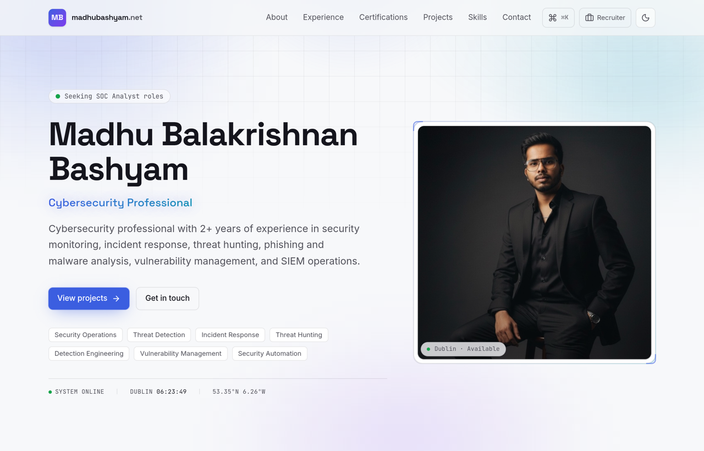

<!-- ===== CUSTOM ANIMATED HERO ===== -->
<div align="center">



<br/>


&nbsp;

&nbsp;


<!-- ===== NAV ===== -->
<br/><br/>

<a href="#whoami"></a>
<a href="#experience"></a>
<a href="#skills"></a>
<a href="#tip"></a>
<a href="#projects"></a>
<a href="#connect"></a>

</div>


<!-- ===== ABOUT ===== -->
<a id="whoami"></a>
## 🧬 `whoami`

```bash
Madhu Balakrishnan Bashyam ~ Cyber Security Analyst @ Fenergo
> Since:  Nov 2025 · Dublin, Ireland
> SOC:    Microsoft Sentinel (KQL) · CrowdStrike Falcon · Microsoft Defender
> Also:   threat hunting · IOC analysis · Qualys VM · Python & PowerShell
```

> 🛡️ &nbsp; SOC monitoring, detection engineering & incident response
> 🔬 &nbsp; Threat hunting, IOC analysis & vulnerability management
> 🌐 &nbsp; Portfolio + write-ups → **[madhubashyam.net](https://madhubashyam.net)**

<details>
<summary><b>⚡ more about me</b></summary>

<br/>

- 🔭 &nbsp; **Cyber Security Analyst @ Fenergo** — Dublin, Ireland (Nov 2025 – present)
- 🧪 &nbsp; Day-to-day: alert triage, threat hunting, KQL detections & threat-intel enrichment
- 🛠️ &nbsp; Automating investigation workflows with **Python & PowerShell**
- 📈 &nbsp; Focused on reducing false positives and improving detection coverage
- 🎓 &nbsp; 2+ years in security operations

</details>


<!-- ===== EXPERIENCE ===== -->
<a id="experience"></a>
## 💼 `experience`

### Cyber Security Analyst · Fenergo
`Nov 2025 – Present` &nbsp;·&nbsp; Dublin, Ireland

- Monitor and investigate security alerts across enterprise and cloud environments using **Microsoft Sentinel**, **KQL**, **CrowdStrike Falcon** and **Microsoft Defender** — enabling faster identification and response to potential threats.
- Perform **incident triage, threat hunting and IOC analysis** across endpoint, network, phishing and malware incidents, supporting timely containment and remediation.
- Develop and optimise **KQL detection queries, correlation logic and monitoring rules**, improving threat visibility and reducing false-positive alerts.
- Enrich malicious IPs, domains, URLs and files using **threat-intelligence** sources for greater context and accuracy during investigations.
- Assess and prioritise vulnerabilities using **Qualys**, support remediation activities and validate fixes to reduce exposure across enterprise environments.
- Automate repetitive security tasks with **Python and PowerShell**, and collaborate with technical teams through **Jira and ServiceNow** to improve operational efficiency and incident tracking.


<!-- ===== SKILLS ===== -->
<a id="skills"></a>
## 🧠 `skills`

<div align="center">



<br/><br/>

**Security Operations**


<br/>

**Automation &amp; Workflow**


<br/>

**Also work with**


</div>


<!-- ===== DYNAMIC: SECURITY TIP OF THE DAY ===== -->
<a id="tip"></a>
## 💡 `security_tip_of_the_day`

<!-- TIP:START -->
> 🔐 **Threat-model early — ask 'what can go wrong?' before writing the code.**
>
> <sub>Auto-rotated daily by a GitHub Action · tip #20 of 20</sub>
<!-- TIP:END -->


<!-- ===== PROJECTS ===== -->
<a id="projects"></a>
## 🚀 `projects`

### ⭐ Featured — madhubashyam.net

<a href="https://madhubashyam.net"></a>

My cybersecurity portfolio & write-ups — a **SOC-style dashboard** with a ⌘K command palette, a live terminal, MDX security write-ups, and a dedicated recruiter view. Built with Next.js 16, TypeScript & Tailwind v4.

[](https://madhubashyam.net)
&nbsp;
[](https://github.com/Madhu1905/madhubashyam.net)

### 🔧 More projects

| Project | What it does | Stack |
|---------|--------------|-------|
| 🔎 **[Python_Vulnerability_Scanner](https://github.com/Madhu1905/Python_Vulnerability_Scanner)** | Scans targets for common security vulnerabilities and reports findings |  |
| 🕵️ **[usb-insider-threat-security](https://github.com/Madhu1905/usb-insider-threat-security)** | Detects insider-threat activity from unauthorized USB devices |  |


<!-- ===== CONNECT ===== -->
<a id="connect"></a>
## 🔗 `connect`

<div align="center">

[](https://linkedin.com/in/madhubalakrishnanbashyam)
[](https://madhubashyam.net)

<br/><br/>


</div>
